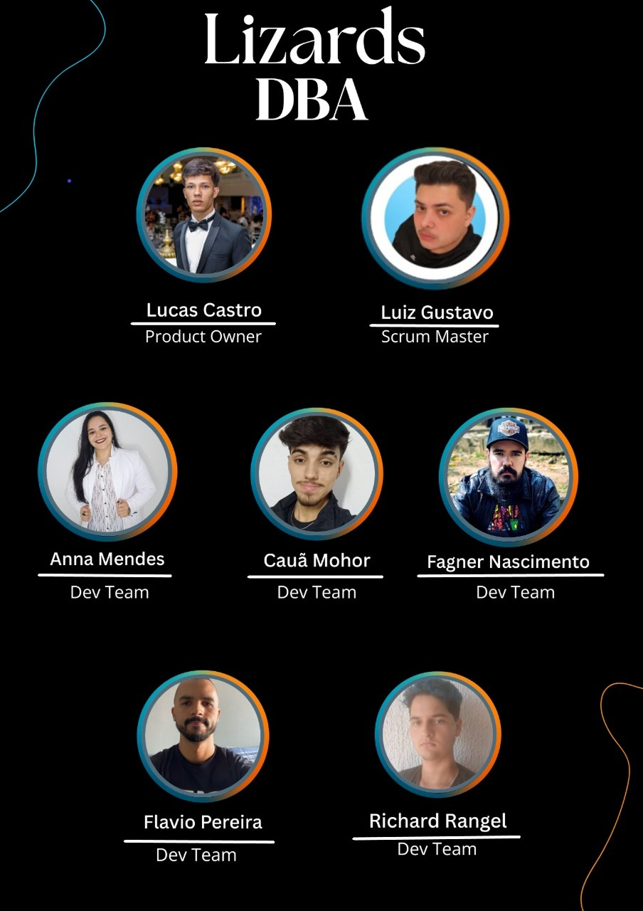

# API 2º Semestre BD

## Título do projeto
#### Ciclo de Vida de TG da modalidade Portfólio

## Descrição do projeto
#### A confecção e orientação de Trabalhos de Graduação (TG) da modalidade Portfólio representam um desafio tanto para os alunos quanto para os professores. Um TG Portfólio é composto por uma seção de apresentação do aluno e várias seções correspondentes aos APIs, uma para cada semestre (com um total de 6). Geralmente, o aluno envia uma seção do TG por vez para que seu orientador corrija. O orientador então revisa a seção e retorna um feedback. Essa interação pode ocorrer diversas vezes para a seção, até que o orientador esteja satisfeito com o resultado.

## Backlog do Produto

## Evolução do Projeto

## Sprints

## Tecnologias utilizadas
<h4 align="left">

</h4>

## Estrutura do projeto

## Como executar, usar e testar o projeto

## Documentação

## Equipe

 

  <table>
    <tr>
      <th>Membro</th>
      <th>Função</th>
      <th>Github</th>
      <th>Linkedin</th>
    </tr>
    <tr>
      <td>Lucas Castro</td>
      <td>Product Owner</td>
      <td></td>
      <td></td>
    </tr>
    <tr>
      <td>Luiz Gustavo</td>
      <td>Scrum Master</td>
      <td></td>
      <td></td>
    </tr>
    <tr>
      <td>Anna Mendes</td>
      <td>Desenvolvedor</td>
      <td></td>
      <td></td>
    </tr>
    <tr>
      <td>Cauã Mohor</td>
      <td>Desenvolvedor</td>
      <td></td>
      <td></td>
    </tr>
    <tr>
      <td>Fagner Nascimento</td>
      <td>Desenvolvedor</td>
      <td></td>
      <td></td>
    </tr>
    <tr>
      <td>Flávio Pereira</td>
      <td>Desenvolvedor</td>
      <td></td>
      <td></td>
    </tr>
    <tr>
      <td>Richard Rangel</td>
      <td>Desenvolvedor</td>
      <td></td>
      <td></td>
    </tr>
  </table>

## Requisitos de Permanência

Conversamos sobre alguns pontos importantes para que ninguém seja retirado do grupo e eles podem se atualizar durante o desenvolvimento do projeto:

- Reuniões fixas: todas as quintas-feiras (aula disponibilizada: 18h45 às 19h35).
- Ferramenta de Gestão: Manter sempre o Backlog atualizado no Notion.
- Comunicação: sempre se comunique com o grupo pelo WhatsApp ou pessoalmente para conseguir alinhar sobre as mudanças necessárias e ajudar o grupo no projeto.
- Prazos: atente-se aos prazos. Lembre-se: o projeto é importante para a conclusão do 2º semestre.

</body>
</html>
